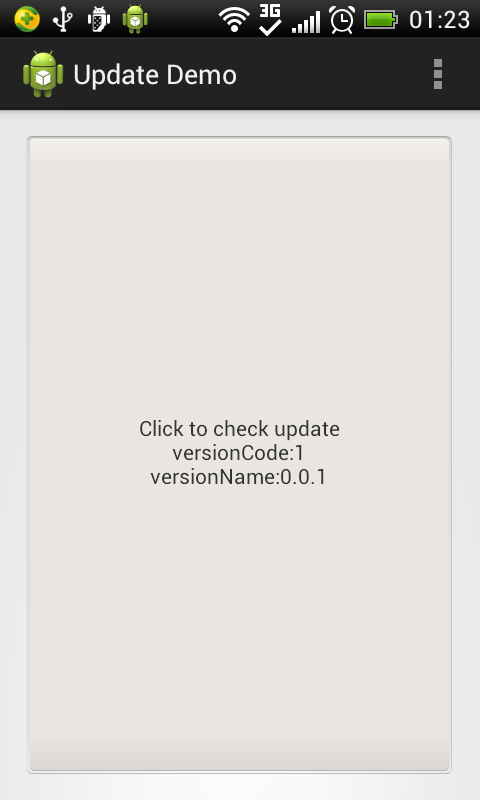
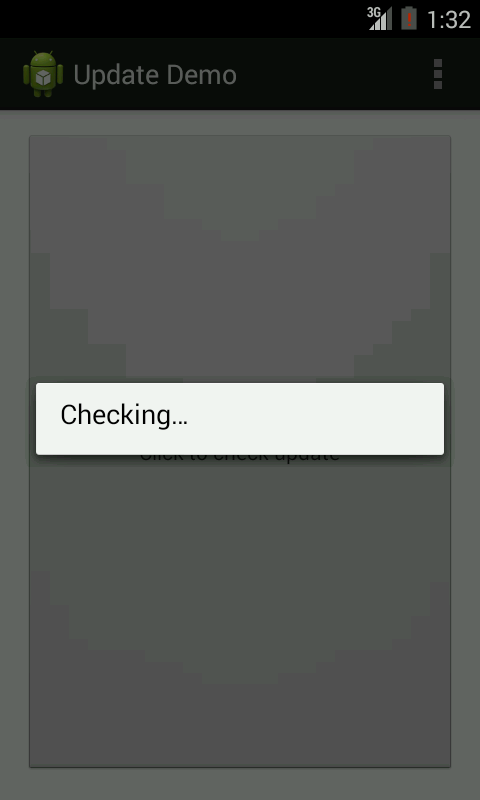
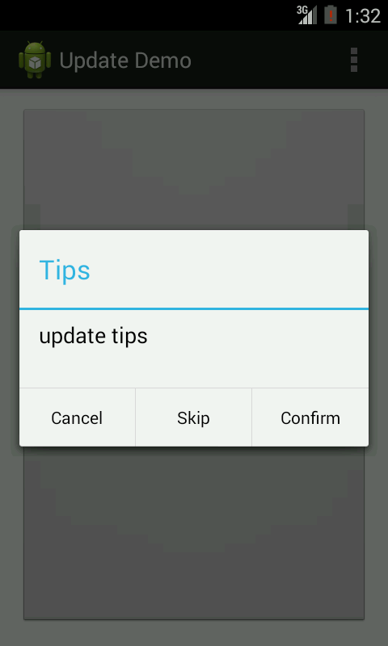
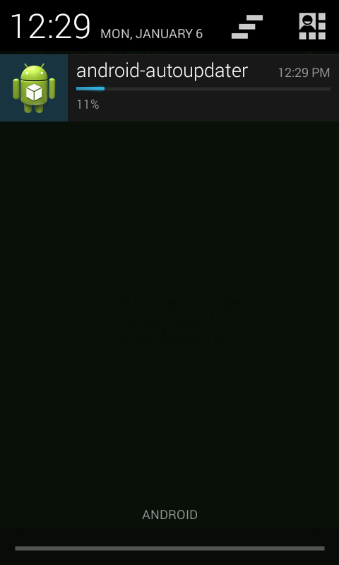
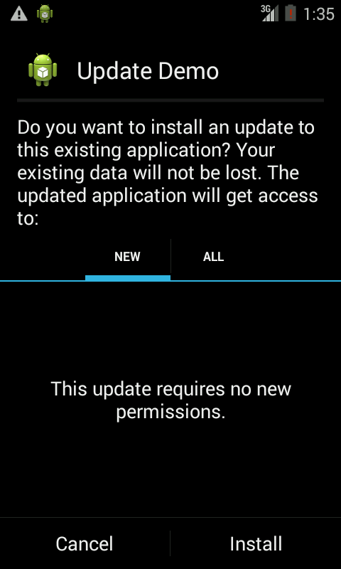

#android-autoupdater

##Introduction
android lib - autoupdater

##Demo
[Github][0]
[Google Play][1]

##Preview






##Specifications
[Android Autoupdate Specification V1.0](docs/specifications/spec1.0.md)

##System requirements
Android 2.2+

##Download
Download [the latest aar][2] or grab via Maven:

```xml
<dependency>
  <groupId>com.github.snowdream.android.app</groupId>
  <artifactId>updater</artifactId>
  <version>1.0</version>
  <type>aar</type>
</dependency>
```

or Gradle:
```groovy
    compile 'com.github.snowdream.android.app:updater:1.0@aar'
```

##Usage
1、upload the new apk to the webserver,get the apk url,as follows.  
```html
https://raw.github.com/snowdream/android-autoupdate/master/docs/test/android-autoupdater-v2.0-release.apk
```

2、read [Android Autoupdate Specification V1.0](docs/specifications/spec1.0.md)
 then touch the file update.xml
```xml
<?xml version="1.0" encoding="UTF-8"?>
<updateInfo>
    <appName>android-autoupdater</appName>
    <appDescription>android autoupdater</appDescription>
    <packageName>com.github.snowdream.android.apps.autoupdater</packageName>
    <versionCode>2</versionCode>
    <versionName>2.0</versionName>
    <forceUpdate>false</forceUpdate>
    <autoUpdate>false</autoUpdate>
    <apkUrl>https://raw.github.com/snowdream/android-autoupdate/master/docs/test/android-autoupdater-v2.0-release.apk</apkUrl>
    <updateTips>
        <default>update tips</default>
        <en>update tips</en>
        <zh>升级提示\n1.版本检查\n2.版本维护\n3.版本更新</zh>
        <zh_CN>升级提示</zh_CN>
        <zh_TW>升级提示</zh_TW>
        <zh_HK>升级提示</zh_HK>
    </updateTips>
</updateInfo>
```

3、upload the update.xml to the webserver,get the file url,as follows.  
```html
https://raw.github.com/snowdream/android-autoupdate/master/docs/test/updateinfo.xml
```

4、get the lib in you project. write this into the build.gradle.
```
    compile 'com.github.snowdream.android.app:updater:1.0@aar'
```

5、where you want to check update,write as follows.
```java
UpdateManager manager = new UpdateManager(this);

UpdateOptions options = new UpdateOptions.Builder(this)
        .checkUrl("https://raw.github.com/snowdream/android-autoupdate/master/docs/test/updateinfo.xml")
        .updateFormat(UpdateFormat.XML)
        .updatePeriod(new UpdatePeriod(UpdatePeriod.EACH_TIME))
        .checkPackageName(true)
        .build();
manager.check(this, options);
```

or
```java
UpdateManager manager = new UpdateManager(this);

UpdateOptions options = new UpdateOptions.Builder(this)
        .checkUrl("https://raw.github.com/snowdream/android-autoupdate/master/docs/test/updateinfo.xml")
        .updateFormat(UpdateFormat.XML)
        .updatePeriod(new UpdatePeriod(UpdatePeriod.EACH_TIME))
        .checkPackageName(true)
        .build();

manager.check(this, options,new AbstractUpdateListener() {
            /**
             * Exit the app here
             */
            @Override
            public void ExitApp() {

            }

            /**
             * show the update dialog
             *
             * @param info the info for the new app
             */
            @Override
            public void onShowUpdateUI(UpdateInfo info) {

            }

            /**
             * It's the latest app,or there is no need to update.
             */
            @Override
            public void onShowNoUpdateUI() {

            }

            /**
             * show the progress when downloading the new app
             *
             * @param info
             * @param task
             * @param progress
             */
            @Override
            public void onShowUpdateProgressUI(UpdateInfo info, DownloadTask task, int progress) {

            }

            /**
             * show the checking dialog
             */
            @Override
            public void onStart() {
                super.onStart();
            }

            /**
             * hide the checking dialog
             */
            @Override
            public void onFinish() {
                super.onFinish();
            }
        });
```

##License
```
Copyright (C) 2013 Snowdream Mobile <yanghui1986527@gmail.com>

Licensed under the Apache License, Version 2.0 (the "License");
you may not use this file except in compliance with the License.
You may obtain a copy of the License at

        http://www.apache.org/licenses/LICENSE-2.0

Unless required by applicable law or agreed to in writing, software
distributed under the License is distributed on an "AS IS" BASIS,
WITHOUT WARRANTIES OR CONDITIONS OF ANY KIND, either express or implied.
See the License for the specific language governing permissions and
limitations under the License.
```

[0]:https://raw.github.com/snowdream/android-autoupdater/master/docs/test/android-autoupdater-v1.0-release.apk
[1]:https://play.google.com/store/apps/details?id=com.github.snowdream.android.apps.autoupdater
[2]:https://oss.sonatype.org/content/groups/public/com/github/snowdream/android/app/updater/1.0/updater-1.0.aar
